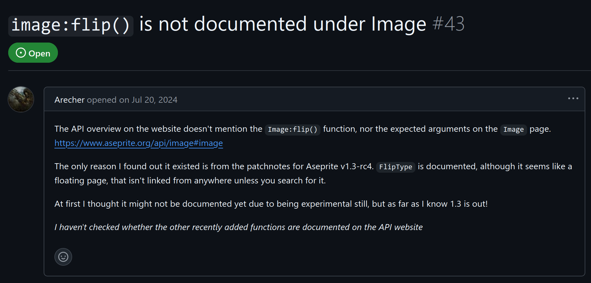
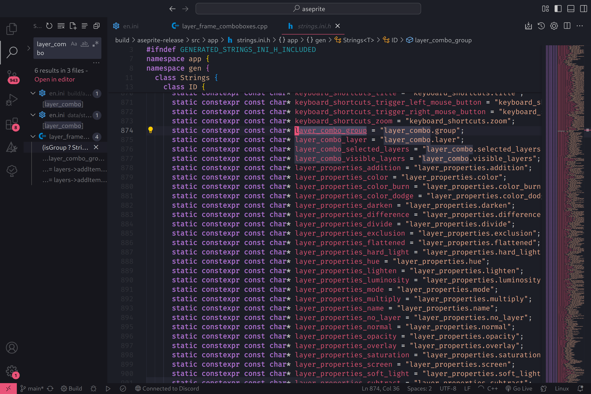
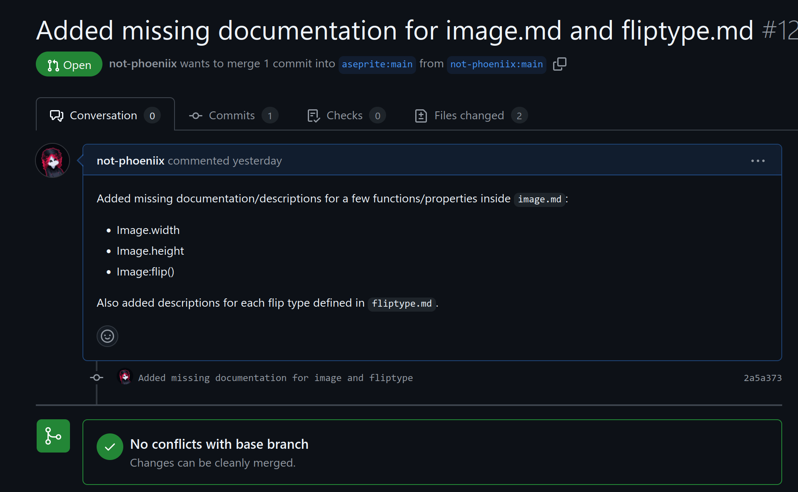

# Improving image documentation for the Aseprite API
For my contribution I selected the community of Aseprite. Aseprite is an open source pixel art editor that I use on a daily basis. I picked this project since I've been using it as an art program for years and I'm very familiar with it's functions and community.

## Intro to the community

Upon inspection the Aseprite community passes the comm arch initial inspection. There are several repositories under the general [Aseprite](https://github.com/aseprite) user on GitHub, namely the [Aseprite repo](https://github.com/aseprite/aseprite) for the program itself, the [program docs repo](https://github.com/aseprite/docs), and the [API docs repo](https://github.com/aseprite/api). Each repo has few pull requests with requests being merged relatively quickly. Since there are fewer contributers in general, commits occur less frequently but the plethora of contributors shows that the community is active.

The documentation on contributing came in the form of the CONTRIBUTING.md and CODE_OF_CONDUCT.md documents in the main Aseprite repo. These documents guided new contributors on what to do to get started and pointed me in the right direction. 

## The issue
I started by looking for issues I could contribute to in the main Aseprite repo but I quickly realized that most issues involved some intensive coding. I wasn't too familiar with the Aseprite codebase so I skimmed through the command system and got somewhat of an understanding of how it worked. As I researched, I began looking for issues in secondary repos and [found one](https://github.com/aseprite/docs/issues/43) surrounding the documentation of images in the API.

I recognized this issue as a simple first contribution, and with my new-found knowledge of how the command system worked I could dig into the code to write some good documentation.

## The contribution
I quickly made a fork of the aseprite API repo and also cloned the entire Aseprite program repo to sift through when writing documentation. Since I'd never written any scripts in the Aseprite API I also learned some of the basics (and also learned and wrote LUA for the first time) so I could understand and write better examples. 

The original issue discussed missing documentation specifically on the Image:flip function, but I noticed more aspects of the page was also blank so I decided to write more there too! I added descriptions for various other properties of the Image class and wrote some more examples.

### Roadblocks

The biggest roadblock I encountered in this contribution was in the form of understanding the codebase. I needed to brush up on my familiarity with C++ and really dig deep to understand how the running and compilation of the program functioned. I got to the point of compiling the project and observing changes in the build as I made small tweaks in the code to understand how things worked together. Once I made it over this roadblock, however, writing the documentation itself was much easier as I had a greater understanding of the system I was working with.

### PR

I have yet to get my pull request merged, but the pull request itself can be seen here, pull request [#121](https://github.com/aseprite/api/pull/121). Since this pull request was made relatively recently I don't anticipate it being merged immediately, but with the low pull request count on this documentation repo I anticipate it recieves slightly less attention compared to the main program repo. Regardless, I learned a lot as this was my first ever pull request.

