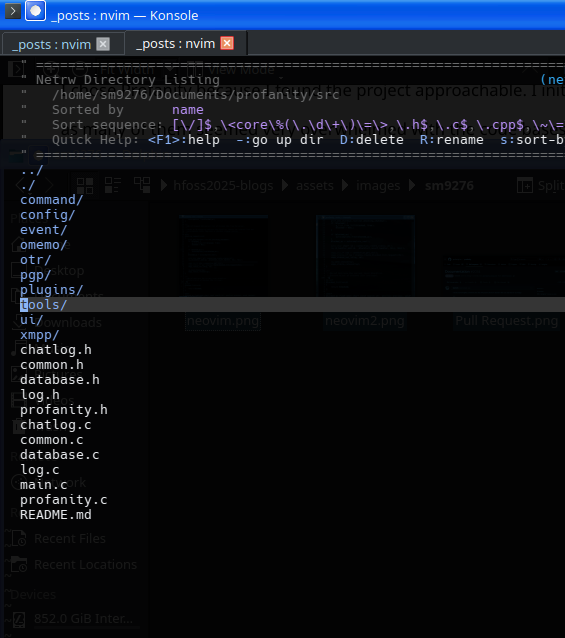
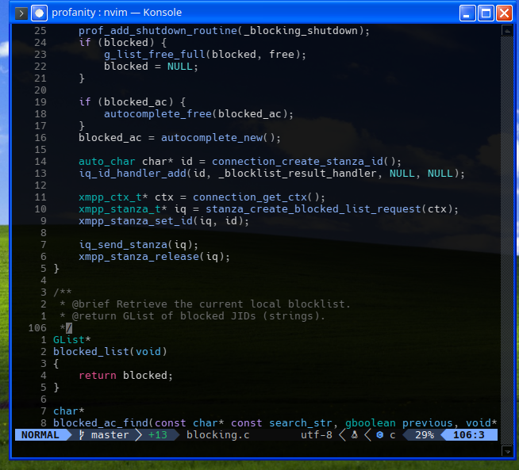
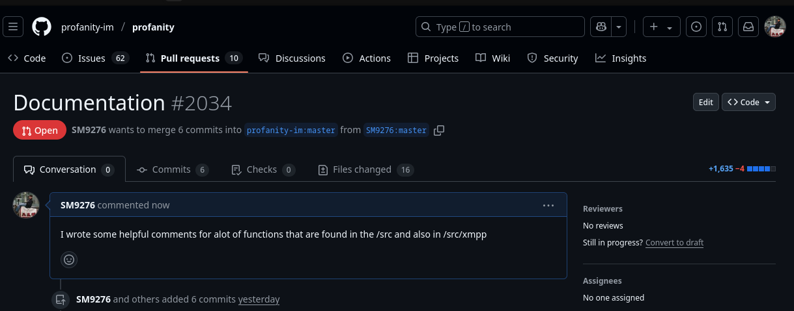
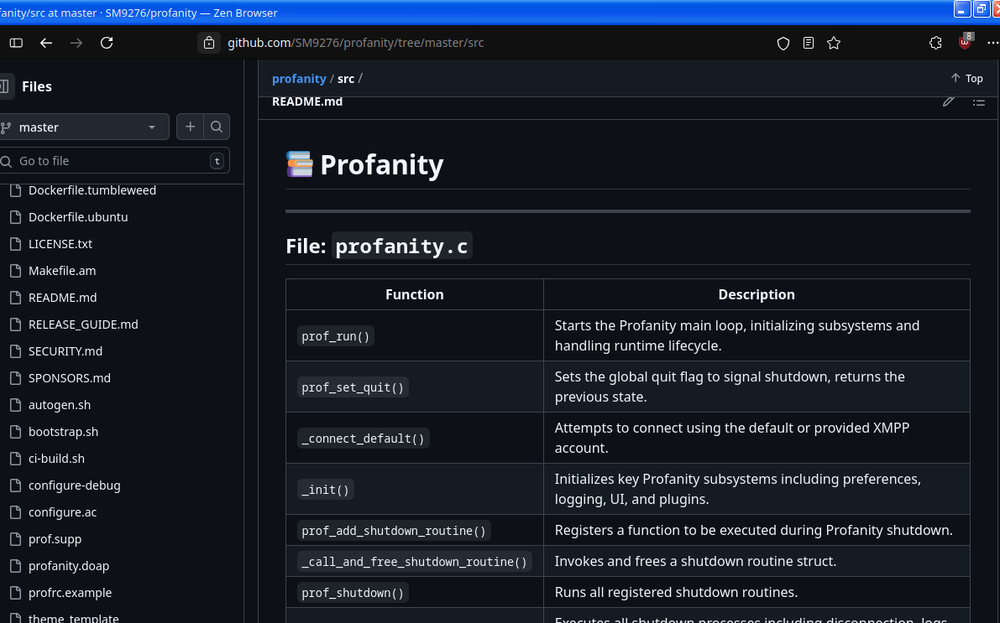

---

layout: post

# If your post title is longer or more complicated

# than can be represented in the filename, uncomment the following line

# and specify a custom title

# title: "Profanity: XMPP Client Documentation"

categories: 

- Contribution

# Enter your name below.

author: Sergio Mercado Nunez

---

## Introduction to the Community

For my first open-source contribution, I chose to work with the [Profanity](https://github.com/profanity-im/profanity) project,
which is a lightweight, terminal-based XMPP client written in C. I chose Profanity because I found the project approachable. 
I initially struggled with picking a project. As many of them seemed very overwhelmed with the code bases. 
I decided to do documentation because I had a lot of trouble looking for a project to contribute to; 
I was too intimidated by the code most of the time. 
I realized that most of the projects I could just try to understand and document the code, which will make it easier for myself and others to try and contribute to projects.

## Why I Picked It

The reason I picked Profanity is because I am super interested in XMPP as a protocol; it seems so awesome and secure. I wanted to work on a project that I would use, so I set up an XMPP account so I can use it with this client.
I saw that the program was written in C, which is a language I am comfortable in. 

## Onboarding Resources

Some of the resources that I found are the following:
- HelpedREADME.md me set up the project and understand its purpose.
- ProvidedCONTRIBUTING.md instructions on how to submit issues and pull requests.
These resources made it easier for me to understand how to best contribute.

## The Issue

I decided to take on the task of improving documentation of the Profanity codebase, starting with the files in src\ and src\xmpp.

## Process

1. I forked the repository and built the project locally to ensure I could test any changes I made.
2. I read through the code src\ and wrote structured comments for each function.
3. I used Git to commit my changes and created a pull request on GitHub.
4. I created a pull request.

## Challenges

The main challenge I faced was fully understanding what each function was doing; I used generative AI to help me.
I ended up having over 1000+ lines of comments.
I also added a README in `src\` that contains an overview of the files and functions

